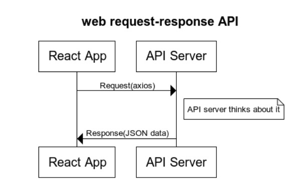

# City Explorer

**Author**: Farah Jamal
**Version**: 1.0.1 
## Deployed site:
https://city-explorer-301.netlify.app/
## Overview
React App that help user to check the exact location for every city and a map fo it.
**this is a part of assignmet for CODE301/ASAC/Code_fellows**

## Getting Started
1- clone with SSH or http to your machine.

2- `npm i` inside the directory

3-npm start 

## Architecture
<!-- Provide a detailed description of the application design. What technologies (languages, libraries, etc) you're using, and any other relevant design information. -->
## Change Log

 - 1-8-2021 1:06pm - Application has been initialized. -->
 - 1-8-2021 1:53pm - Application has the front end. -->
 - 1-8-2021 2:53pm - Application can preview data to the user with a card. -->
 - 1-8-2021 3:42pm - Application can preview data to the user with a card and Map. -->
 - 1-8-2021 4:00pm - Error handling(try and catch with Modal). -->
 - 1-8-2021 10:00pm - Application design finished and ready to deploy-->

 

## Credit and Collaborations

## web request-response Drawing:

